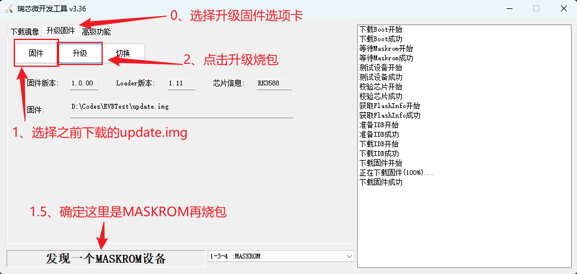

# RK3588 EVB7-V11 调试与功能验证总结
## 一、核心进展与主要工作
1. 设备树调试与GPIO自动控制

    - 学习并掌握了设备树 pinctrl + regulator-fixed 的标准写法，实现了上电后多路 GPIO 自动输出高电平，所有指示灯可自动点亮。
    - 理解了 gpio-hog 与 regulator-fixed 的区别，选择了更通用、可靠的“两行配置法”。
    - 熟悉了设备树语法、结构、常见报错排查方法，提升了定位和修改效率。
2. SD卡供电与识别问题解决

    - 通过设备树正确配置 SD 卡电源控制 GPIO，解决了 SD 卡无法识别、供电异常等问题。
    - 验证了 SD 卡分区、挂载、读写功能均正常。
3. 以太网和WiFi网络配置

    - 配置并验证了 eth0 静态 IP，确保每次烧录后网络可用。
    - 配置 wpa_supplicant，成功实现 WiFi 自动连接，掌握了无线网卡模式切换和常见问题排查方法。
    - 验证了网络连通性，能正常访问外网（如 Bilibili）。
4. 蓝牙、USB、PCIE、M.2等外设功能验证

    - 蓝牙模块识别、启动、扫描功能验证。
    - USB HUB、PCIE转MDI、M.2 NVMe等模块的识别与基本功能测试。
    - 记录了各模块的验证方法和当前状态。
5. 文档完善与标准化

    - 梳理并完善了各功能模块的验证步骤、常用命令、配置方法，形成了结构化的调试手册。
    - 总结了常见问题及解决思路，便于后续团队成员参考。
## 二、环境准备与基础配置
### 2.1 编译流程：
当前已经实现容器编译(docker)
公司内通过账号密码登陆192.168.1.11服务器。通过docker ps命令可以看到目前已经创好的容器实例
```sh
jinyingjie@ubuntu:~$ sudo docker ps -a
CONTAINER ID   IMAGE       COMMAND       CREATED        STATUS                      PORTS     NAMES
0d0055fd493e   docker_rk   "/bin/bash"   26 hours ago   Exited (0) 28 seconds ago             rk3588Compile
jinyingjie@ubuntu:~$
```
通过docker start可以进入docker内部，此举相当于进入了一个独立的配置好了的编译环境
```sh
jinyingjie@ubuntu:~$ sudo docker start -i rk3588Compile
root@0d0055fd493e:/#
```
此时命令行变成了root@前面显示的containerID，下一步就是进入到共同目录`/data/`下的当前已经解压好了的rk3588SDK压缩包的目录下
```sh
root@0d0055fd493e:/# cd /data/rk3588_linux_default_20250120/
root@0d0055fd493e:/data/rk3588_linux_default_20250120#
root@0d0055fd493e:/data/rk3588_linux_default_20250120# ./build.sh
```
**大坑警告**：如果第一次编译，一定要先执行、`./build.sh lunch`再往后执行否则必现无法定位的编译问题。

当界面出现如下回显的时候，就说明编译通过了：
```sh
Make firmware OK!
------ OK ------
********rkImageMaker ver 2.29********
Generating new image, please wait...
Writing head info...
Writing boot file...
Writing firmware...
Generating MD5 data...
MD5 data generated successfully!
New image generated successfully!

Run 'make edit-package-file' if you want to change the package-file.

Running mk-updateimg.sh - build_updateimg succeeded.
Images under /data/rk3588_linux_default_20250120/output/firmware/ are ready!
Running mk-firmware.sh - build_firmware succeeded.
Running 99-all.sh - build_all succeeded.
root@0d0055fd493e:/data/rk3588_linux_default_20250120# 
```
我们要用的只有output目录下的.img文件，执行如下命令拷贝到自己的目录
```sh
cp ../output/update/Image/update.img /home/jinyingjie/
```
然后通过mobaXterm下载.img文件后面烧包用
## 2.2 烧包流程
1. windows端打开目录`D:\Work\3588 SDK-from zhoubo\rk3588_linux_default_20250120\tools\windows`解压其中的`DriverAssitant_v5.13.zip`并且安装
2. 打开`D:\Work\3588 SDK-from zhoubo\rk3588_linux_default_20250120\tools\windows\RKDevTool\RKDevTool_Release`目录下的`RKDevTool.exe`界面如下:

    

3. 确定板子的插法如下所示，typeC线插到数据传输接口上
   
   

4. 在下图的按钮处，按住`maskrom`按钮的同时按一下`reset按钮`，则上面的界面中可以发现了显示MASKROM设备
5. 按照上图的步骤点选择固件升级即可
## 2.3 patch机制
### 2.3.1 简介
patch 机制是 Linux/嵌入式开发中常用的代码变更管理方式。通过 patch 文件，可以记录和分享对源码的修改内容，便于团队协作、版本追溯和快速复用。

在 RK3588 SDK 的开发和维护过程中，patch 文件常用于：
- 修复官方源码的 bug
- 增加自定义功能或适配特定硬件
- 管理本地定制化修改，便于后续 SDK 升级时合并
### 2.3.2 patch 文件的获取与存放
本次项目 patch 文件统一存放在此文件同目录下 `rk3588Compile/patch/` 下，便于管理和批量应用。例如：
```
rk3588Compile/
└── patches/
    ├── 0001-fix-sdmmc-power.patch
    ├── 0002-add-gpio-init.patch
    └── 0003-custom-feature.patch
```
### 2.3.3 patch 文件的应用方法
手动应用单个 patch：
```sh
patch -p1 < ../rk3588Compile/patches/0001-fix-sdmmc-power.patch
```
批量应用所有 patch：
```sh
cd /data/rk3588_linux_default_20250120/kernel
for p in ../rk3588Compile/patches/*.patch; do
    patch -p1 < "$p"
done
```
用 git 管理 patch（推荐）：
```sh
git am ../rk3588Compile/patches/*.patch
```

### 2.3.4 patch 文件的生成方法
如果你在源码目录有本地修改，可以用如下命令生成 patch 文件：
```sh
git diff > ../rk3588Compile/patches/xxxx-feature.patch
# 或者
git format-patch HEAD~1  # 生成最近一次提交的patch
```
### 2.3.5 管理建议
- 建议每个 patch 文件只做一类功能修改，便于后续维护和合并。
- patch 文件要有规范命名和注释，方便团队成员理解和使用。
- 在代码合入主线前，建议先在本地应用 patch 并验证通过。
## 三、功能模块验证
### 3.1 网络WLAN验证
- 当前状态/结论：已完成验证

增加了自动连接 WiFi 的说明，强调 wpa_supplicant 配置和系统自启动机制。
补充了无线网卡模式切换、常见报错处理方法。
```sh
   vi /etc/wpa_supplicant.conf # 修改用户名密码

    network={
            ssid="DKKJ-SH_5G"
            psk="dkkj1125"
            key_mgmt=WPA-PSK
    }

   wpa_supplicant -B -i wlan0 -c /etc/wpa_supplicant.conf # 通过配置文件链接路由器
   udhcpc -i wlan0 # 获取IP地址
   iw wlan0 link # 验证链接
   ifconfig wlan0 # 查看网络IP

# 复制固件文件
cp ./external/rkwifibt/firmware/broadcom/AP6354/wifi/brcmfmac4354-sdio.bin ./external/rkwifibt/firmware/broadcom/AP6354/wifi/brcm/
cp /lib/firmware/brcm/brcmfmac4354-sdio.rockchip,rk3588-evb7-v11.txt ./external/rkwifibt/firmware/broadcom/AP6354/wifi/brcm/
```
wpa_supplicant.conf配置：
```conf
ctrl_interface=/var/run/wpa_supplicant
ap_scan=1
update_config=1

network={
        ssid="DKKJ-SH_5G"
        psk="dkkj1125"
        key_mgmt=WPA-PSK
}

```
### 3.2 eth0 配置
- 当前状态/结论：已完成验证

每次重新烧包之后都需要重新配置网络

```sh
vi /etc/network/interfaces
# 文件内容
auto lo
iface lo inet loopback

source-directory /etc/network/interfaces.d

auto eth0
iface eth0 inet static
    address 192.168.137.55
    netmask 255.255.255.0
    gateway 192.168.137.1
#之后重启
reboot

# 修改root密码：
passwd root
# 之后密码也改成root就行了
```

### 3.3 蓝牙
- 当前状态/结论：已完成验证
```sh
root@rk3588-buildroot:~# hciconfig -a # 能看到 hci0 说明蓝牙模块已识别。
hci0:   Type: Primary  Bus: UART
        BD Address: 54:78:C9:E1:63:69  ACL MTU: 1021:8  SCO MTU: 64:1
        UP RUNNING PSCAN
        RX bytes:916 acl:0 sco:0 events:67 errors:0
        TX bytes:3351 acl:0 sco:0 commands:67 errors:0
        Features: 0xbf 0xfe 0xcf 0xfe 0xdb 0xff 0x7b 0x87
        Packet type: DM1 DM3 DM5 DH1 DH3 DH5 HV1 HV2 HV3
        Link policy: RSWITCH SNIFF
        Link mode: PERIPHERAL ACCEPT
        Name: 'BlueZ 5.77'
        Class: 0x6c0414
        Service Classes: Rendering, Capturing, Audio, Telephony
        Device Class: Audio/Video, Loudspeaker
        HCI Version: 5.3 (0xc)  Revision: 0x495
        LMP Version: 5.3 (0xc)  Subversion: 0x1111
        Manufacturer: Broadcom Corporation (15)

root@rk3588-buildroot:~# hciconfig hci0 up # 启动蓝牙服务
root@rk3588-buildroot:~# hcitool scan # 扫描附近蓝牙设备
Scanning ...
        8C:E9:EE:6C:B8:16       n/a
        C0:A5:E8:4E:8D:E1       n/a
root@rk3588-buildroot:~#

```

### 3.4 SD卡 
- 简介：用于插入SD存储卡，扩展存储空间。
 
- 验证方法：插入SD卡后，执行 lsblk、fdisk -l 或 ls /dev/mmc*，能识别出新设备即可。可尝试挂载读写。

- 插入SD卡后，执行 `fdisk -l`，可见分区信息如下：
```sh
root@rk3588-buildroot:~# fdisk -l
Found valid GPT with protective MBR; using GPT

Disk /dev/mmcblk0: 488554496 sectors,  984M
Logical sector size: 512
Disk identifier (GUID): 4e230000-0000-4f2e-8000-41980000114f
Partition table holds up to 128 entries
First usable sector is 34, last usable sector is 488554462

Number  Start (sector)    End (sector)  Size Name
     1           16384           24575 4096K uboot
     2           24576           32767 4096K misc
     3           32768          163839 64.0M boot
     4          163840          425983  128M recovery
     5          425984          491519 32.0M backup
     6          491520        29851647 14.0G rootfs
     7        29851648        30113791  128M oem
     8        30113792       488554431  218G userdata
```
- 执行 `ls /dev/mmc*`，可见设备节点如下：
```sh
root@rk3588-buildroot:~# ls /dev/mmc*
/dev/mmcblk0  /dev/mmcblk0boot0  /dev/mmcblk0boot1  /dev/mmcblk0p1  /dev/mmcblk0p2  /dev/mmcblk0p3  /dev/mmcblk0p4  /dev/mmcblk0p5  /dev/mmcblk0p6  /dev/mmcblk0p7  /dev/mmcblk0p8  /dev/mmcblk0rpmb
```
- 挂载分区测试读写，命令如下：
  mount /dev/mmcblk0p8 /mnt/sd
  ls /mnt/sd
- 当前状态/结论：SD卡识别、分区、挂载均正常。

### 3.4 ES8388 codec 
- 简介：ES8388是一款音频编解码芯片，常用于耳机、麦克风等音频输入输出。
 
- 验证方法：aplay -l、arecord -l 查看声卡设备，插耳机播放/录音测试。可用 alsamixer 调节音量。

- 当前状态/结论：`aplay -l 只识别到 HDMI 声卡，arecord -l 没有录音设备，dmesg | grep -i es8388 没有任何输出，怀疑 ES8388 驱动未加载或设备树未配置，请协助排查。`
```sh
echo 54 > /sys/class/gpio/export
echo out > /sys/class/gpio/gpio54/direction
echo 1 > /sys/class/gpio/gpio54/value

echo 54 > /sys/class/gpio/export
cat /sys/class/gpio/gpio54/value 


alsamixer # 检查音量和静音状态

vi /usr/share/alsa/ucm2/conf.d/rockchip-es8388/HiFi.conf

```
### 3.5 mipi OLED 
- 简介：通过MIPI接口连接的OLED显示屏，显示信息或图像。 
- 验证方法：ls /dev/fb* 查看帧缓冲设备，运行测试程序显示图片或文字。
- 当前状态/结论：无设备暂无法验证
### 3.6 mipi CSI camera 
- 简介：通过MIPI CSI接口连接的摄像头模块。 
- 验证方法：ls /dev/video*，用 v4l2-ctl --list-devices 或 mplayer tv://、ffplay /dev/video0 预览画面。
- 当前状态/结论：无设备暂无法验证
### 3.7 USB HUB
 
- 简介：USB集线器，扩展多个USB接口。
 
- 验证方法：lsusb 查看设备列表，插U盘/鼠标等测试识别和使用。
```sh

# USB 功能 请用新到的TYPE 转USB A的转接线试下。如果还不行。  请看下上电和RST是否存在时序问题，尝试GPIO2_C5_D/EN_USB_HUB_1V8  拉高 ，延迟100ms，GPIO4_A4_D_1.8/3.3V 拉低  **延迟100ms再拉高**
GPIO2_C5_D: 85
GPIO4_A4_D: 132

echo 85 > /sys/class/gpio/export
echo out > /sys/class/gpio/gpio85/direction
echo 1 > /sys/class/gpio/gpio85/value
cat /sys/class/gpio/gpio85/value 

echo 132 > /sys/class/gpio/export
echo out > /sys/class/gpio/gpio132/direction
echo 0 > /sys/class/gpio/gpio132/value
cat /sys/class/gpio/gpio132/value 

echo out > /sys/class/gpio/gpio132/direction
echo 1 > /sys/class/gpio/gpio132/value
cat /sys/class/gpio/gpio132/value 


[   47.084888] usb 2-1: USB disconnect, device number 2
[   54.684780] usb 2-1: new high-speed USB device number 4 using ehci-platform
[   54.833004] usb 2-1: New USB device found, idVendor=0424, idProduct=2137, bcdDevice=60.80
[   54.833102] usb 2-1: New USB device strings: Mfr=1, Product=2, SerialNumber=0
[   54.833126] usb 2-1: Product: USB2137B
[   54.833148] usb 2-1: Manufacturer: SMSC
[   54.834774] hub 2-1:1.0: USB hub found
[   54.835042] hub 2-1:1.0: 7 ports detected
root@rk3588-buildroot:/# lsusb
Bus 005 Device 001: ID 1d6b:0002
Bus 003 Device 001: ID 1d6b:0001
Bus 002 Device 004: ID 0424:2137
Bus 001 Device 001: ID 1d6b:0002
Bus 006 Device 001: ID 1d6b:0003
Bus 004 Device 001: ID 1d6b:0001
Bus 002 Device 001: ID 1d6b:0002
root@rk3588-buildroot:/# ls /sys/bus/usb/devices/
1-0:1.0  2-1      3-0:1.0  5-0:1.0  usb1  usb3  usb5
2-0:1.0  2-1:1.0  4-0:1.0  6-0:1.0  usb2  usb4  usb6
root@rk3588-buildroot:/# cat /sys/bus/usb/devices/2-1/uevent
MAJOR=189
MINOR=131
DEVNAME=bus/usb/002/004
DEVTYPE=usb_device
DRIVER=usb
PRODUCT=424/2137/6080
TYPE=9/0/2
BUSNUM=002
DEVNUM=004
root@rk3588-buildroot:/#

```


- 当前状态/结论：插入拓展坞之后接入其他usb设备功能正常。

### 3.8 PCIE转MDI功能 
- 简介：通过PCIE扩展以太网（MDI为以太网物理层接口）。 
- 验证方法：lspci | grep Eth，ifconfig -a 查看网卡，插网线测试网络连通。
- 当前状态/结论：无设备暂无法验证
### 3.9 MDI HUB功能
- 简介：MDI HUB（以太网集线器）用于将多个以太网设备连接到同一网络，实现数据转发和共享。常用于扩展以太网端口数量。
- 验证方法：插入 MDI HUB 后，使用 lsusb 或 lspci 查看设备识别情况，ifconfig -a 查看是否多出新的以太网接口。插网线后测试多端口数据转发和网络连通性。
- 当前状态/结论：同下面PCIE4: 自组网功能
### 3.10 PCIE1: 4G/5G 
- 简介：通过PCIE插槽扩展4G/5G通信模块，实现蜂窝网络连接。 
- 验证方法：lsusb、lspci 查看模块，mmcli、minicom、AT命令拨号上网测试。
- 当前状态/结论：无设备暂无法验证
### 3.11 PCIE2: 卫通功能 
- 简介：卫星通信模块，通常用于远距离、无地面网络环境下通信。 
- 验证方法：查文档，通常用专用AT命令或上位机软件测试。
- 当前状态/结论：无设备暂无法验证
### 3.12 PCIE3: RTK功能 
- 简介：高精度定位（RTK）模块，常用于无人机、测绘等。 
- 验证方法：lsusb、lspci，用串口工具或专用软件查看定位数据输出。
- 当前状态/结论：无设备暂无法验证
### 3.13 PCIE4: 自组网功能
- 简介：自组网模块可实现多设备间的无线自组织网络，常用于无人机集群、应急通信等场景。
- 验证方法：插入自组网模块后，使用 lsusb、lspci 查看设备识别情况，结合厂商提供的上位机软件或命令行工具进行组网测试，验证节点间通信能力。
- 当前状态/结论：需要上电后给GPIO4_A3_D:131先拉低再拉高，之后可以ping通，命令如下
```sh
GPIO2_B2_U_3.3V  MDI hub 电路 的供电ENGPIO2_B2_U_3.3V 需要拉高。

// GPIO编号对照表
GPIO2_B2_U: 74

echo 74 > /sys/class/gpio/export
echo out > /sys/class/gpio/gpio74/direction
echo 1 > /sys/class/gpio/gpio74/value

echo 74 > /sys/class/gpio/export
cat /sys/class/gpio/gpio74/value 

GPIO4_A3_D:131

ifconfig wlan0 down

echo 131 > /sys/class/gpio/export
echo out > /sys/class/gpio/gpio131/direction
echo 0 > /sys/class/gpio/gpio131/value
cat /sys/class/gpio/gpio131/value 
sleep 0.5
echo out > /sys/class/gpio/gpio131/direction
echo 1 > /sys/class/gpio/gpio131/value
cat /sys/class/gpio/gpio131/value 


echo 131 > /sys/class/gpio/export
cat /sys/class/gpio/gpio131/value 


ifconfig enP3p49s0 192.168.253.100 up
ping 192.168.253.253

root@rk3588-buildroot:/# ifconfig enP3p49s0 192.168.253.100 up
root@rk3588-buildroot:/# ping 192.168.253.253
PING 192.168.253.253 (192.168.253.253) 56(84) bytes of data.
64 bytes from 192.168.253.253: icmp_seq=1 ttl=64 time=2032 ms
64 bytes from 192.168.253.253: icmp_seq=2 ttl=64 time=1015 ms
64 bytes from 192.168.253.253: icmp_seq=3 ttl=64 time=2.26 ms
64 bytes from 192.168.253.253: icmp_seq=4 ttl=64 time=1.10 ms
64 bytes from 192.168.253.253: icmp_seq=7 ttl=64 time=1.06 ms
64 bytes from 192.168.253.253: icmp_seq=10 ttl=64 time=1.26 ms
64 bytes from 192.168.253.253: icmp_seq=11 ttl=64 time=1.47 ms
64 bytes from 192.168.253.253: icmp_seq=13 ttl=64 time=1.28 ms
```
### 3.14 M2-1 NVME固态硬盘 
- 简介：M.2接口的NVMe协议固态硬盘，扩展高速存储。 
- 验证方法：lsblk、fdisk -l、nvme list 查看设备，挂载读写测试。
- 当前状态/结论：无设备暂无法验证
### 3.15 M2-2 4G/5G 低~中 
- 简介：M.2接口的4G/5G通信模块，支持蜂窝网络接入，适合移动数据通信场景。
- 验证方法： 插入模块后，使用 lsusb、mmcli、minicom 等工具检测模块识别情况，插SIM卡后尝试拨号上网，测试数据通信能力。
- 当前状态/结论：无设备暂无法验证
### 3.16 TYPEC 频谱扫频功能 
- 简介：通过Type-C接口连接的频谱仪或扫频模块，用于射频信号分析。 
- 验证方法：查文档，通常需专用上位机软件或命令行工具进行频谱扫描。
- 当前状态/结论：无设备暂无法验证

## 三、常用命令与问题排查
### 4.1 GPIO简介
1. GPIO基本概念：
   
   - GPIO（General Purpose Input/Output，通用输入输出）是嵌入式系统中最常用的硬件接口之一。每个 GPIO 引脚都可以被配置为输入或输出，用于控制外部设备（如LED、继电器、传感器等）或读取外部信号。GPIO 的灵活性使其成为硬件控制和功能扩展的基础。
   - 如编号为`GPIO4_B5_D`的编号是`141`。这个算法相对复杂这里不展开，有兴趣可以去查一查。同目录下的`gpio_name2num.py`脚本里面有详细的计算方式，通过主函数中配置你想要的设备直接执行脚本即可。
2. Linux 下 GPIO 查看方法
- 查看所有 GPIO 当前状态：
```sh
cat /sys/kernel/debug/gpio
```
该命令可以显示所有 GPIO 的分配、方向、电平等信息。
- 导出单个 GPIO 并查看状态：
```sh
echo 141 > /sys/class/gpio/export
cat /sys/class/gpio/gpio141/value
cat /sys/class/gpio/gpio141/direction
```
注意：如果该 GPIO 已被内核驱动或设备树占用，可能无法手动 export。
- 查看已导出的 GPIO 列表：
```sh
ls /sys/class/gpio/
```
3. Linux 下 GPIO 配置方法
在 Linux 系统中，GPIO 通常通过 sysfs 或 debugfs 进行管理和查看。的常用方法如下：
```sh

echo 141 > /sys/class/gpio/export
echo out > /sys/class/gpio/gpio141/direction   # 设置为输出模式
echo 1 > /sys/class/gpio/gpio141/value         # 1为输出高电平 0为输出低电平
```
### 4.2 设备树编译与烧录
- 需求：通过配置dts设备树文件，开机自动配置gpio的电平。
- sdmmc所使用的gpio配置方法：修改`/data/rk3588_linux_default_20250120/kernel/arch/arm64/boot/dts/rockchip/rk3588-evb7-v11.dtsi`文件
```dts
	sdmmc {
		sd_s0_pwr: sd-s0-pwr {
			/* rockchip,pins = <1 RK_PD2 RK_FUNC_GPIO &pcfg_pull_up>; */
			/* rockchip,pins = <1 RK_PD2 RK_FUNC_GPIO &pcfg_pull_down>;  */
			rockchip,pins = <2 RK_PB1 RK_FUNC_GPIO &pcfg_pull_down>;
		};
	};
    /* 中间隔着其他代码 */
    vcc_3v3_sd_s0: vcc-3v3-sd-s0-regulator {
		compatible = "regulator-fixed";
		// gpio = <&gpio1 RK_PD2 GPIO_ACTIVE_HIGH>;
		// gpio = <&gpio1 RK_PD2 GPIO_ACTIVE_LOW>;
		gpio = <&gpio2 RK_PB1 GPIO_ACTIVE_LOW>;
		pinctrl-names = "default";
		pinctrl-0 = <&sd_s0_pwr>;
		regulator-name = "vcc_3v3_sd_s0";
		enable-active-high;
	};
```

### 4.3 常见报错与解决
- 简介：本节收集调试过程中遇到的典型报错及对应的解决方法，便于快速定位和排查问题。
- 常见问题举例：
    - 设备树编译报错：如 syntax error，多为括号、分号、逗号、注释等格式问题，建议重点检查报错行及前后几行。
    - GPIO export 报错：如 Device or resource busy，说明该 GPIO 已被内核驱动或设备树节点占用，需检查设备树配置。
    - SD卡无法识别：多为供电 GPIO 配置错误或未正确挂载，建议检查 regulator 和 pinctrl 配置是否一致。
    - WiFi 连接失败：常见为驱动未加载、wpa_supplicant 配置错误或无线网卡模式未切换，建议按文档步骤逐步排查。
        ```sh
        ip route
        route del default
        route add default gw 192.168.31.1 dev wlan0
        ```
