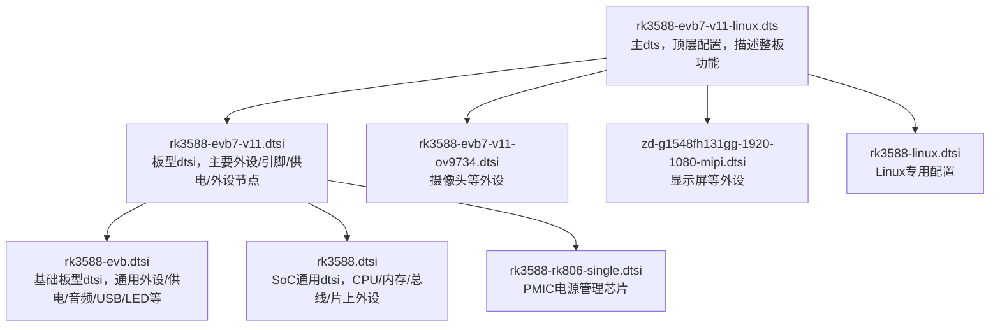
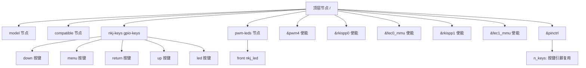
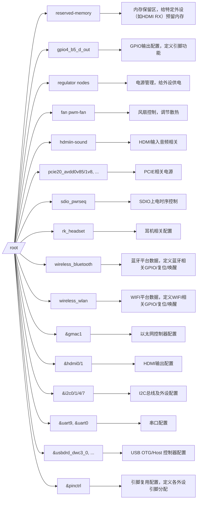
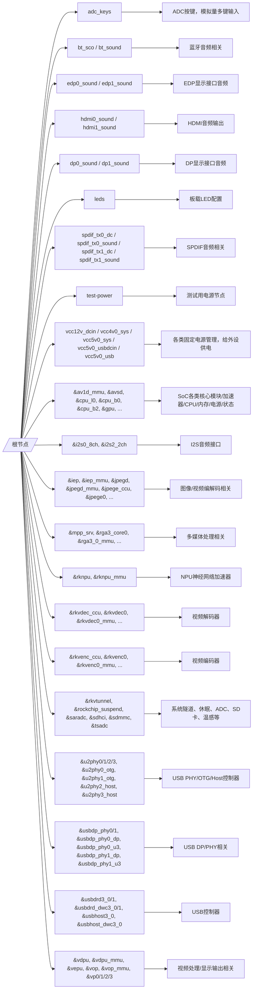

# 1. typec USB3.0 x1	

## 1.1 固件烧录  J2600  已OK
- 用官方烧录工具（如RKDevTool、upgrade_tool）烧录固件，确认能正常识别和烧录。
- 作用：通过USB接口，把系统固件（如bootloader、内核、文件系统等）烧录到主控芯片或存储器里。
- 常见场景：开发板首次烧录、系统升级、救砖。
- 实现方式：主控芯片上电后进入“烧录模式”，PC端用专用工具（如RKDevTool、upgrade_tool）通过USB线传输固件。
## 1.2 USB2.0 3.0 OTG功能 host/devcie	J2600  已OK
- OTG（On-The-Go）
    - 作用：让设备既能当“主机”（Host），也能当“从机”（Device）。
    - 常见场景：手机通过OTG线连接U盘、鼠标、键盘等外设；也可以连接PC当作U盘、ADB等设备。
    - 实现方式：Type-C或Micro-USB接口支持OTG，硬件和驱动支持模式切换。
    - Host模式：设备作为“主机”，可以识别和管理外部USB设备（如U盘、鼠标、键盘、摄像头等）。
    - Device模式：设备作为“从机”，被PC等主机识别（如U盘模式、ADB调试、串口、网卡等）。
    - 切换方式：有的板子通过硬件ID脚、软件配置或Type-C协议自动切换。
- 测试方法：
- 插U盘、移动硬盘，lsusb、fdisk -l、ls /dev/sd* 检查识别情况。
- 用 dmesg 观察插拔日志。
- 切换Host/Device模式，连接PC看能否识别为设备（如ADB、U盘模式）。
- `lsusb`  
  `fdisk -l`  
  `ls /dev/sd*`  
  `dmesg | tail -n 50`  # 查看插拔日志
## 1.3 PD control I2C 通信（详细功能待定无充电控制，仅数据通信）	J2600  已OK
- PD control I2C（USB Power Delivery控制）
    - 作用：通过I2C总线与Type-C PD（Power Delivery）芯片通信，实现高压快充、功率协商等功能。
    - 常见场景：Type-C口支持多种电压/电流档位，主控通过I2C配置PD芯片，决定供电/充电参数。
    - 一般用法：如果只做数据通信，不涉及快充，可以不用管PD控制。

- 如果Type-C PD芯片已禁用，可跳过。
- 若需测试，需用i2cdetect、i2cget、i2cset等工具访问PD芯片地址，确认I2C通信正常。

## 1.4 SY6861B1ABC  5V switch 功能	U2603  已OK
- 作用：通过芯片或外部电路控制USB口的5V供电开关，决定是否给外设供电。
- 常见场景：节能、过流保护、热插拔保护等。
- 实现方式：主控通过GPIO或I2C控制5V开关芯片（如SY6861B1ABC），实现USB口供电的开/关。
# 2. HDMI TX x 1   已OK
## 功能： HDMI显示，调整图幅比例16:9 J5000
连接显示器，确认HDMI输出正常，分辨率、比例可调。
用 xrandr 或 modetest 工具测试分辨率切换。

- **HDMI分辨率切换**  
  `modetest -c`  # 查看所有输出和分辨率  
  `modetest -s <connector_id>:<分辨率>`  # 切换分辨率，如 `modetest -s 208:1920x1080`  
  `modetest -s <connector_id>:#<mode编号>`  # 用模式编号切换


# 3. USB2.0 host x2    已OK
- 插入U盘、鼠标、键盘，lsusb 检查识别。
- 多口同时插拔测试。
- 插入U盘、鼠标、键盘，执行
```sh
lsusb
fdisk -l
ls /dev/sd*
dmesg | tail -n 50
```
- 多口同时插拔测试，确认所有USB口都能识别设备。
- 如有OTG/5V switch等特殊功能，按子项逐步验证。

# 4. 外部UARTx4	
- 用串口线连接PC，minicom、screen、picocom等工具收发数据，验证每路UART收发正常。
- 1. UART 展开来是什么意思？
    - UART 全称是 Universal Asynchronous Receiver/Transmitter，即“通用异步收发器”，是最常见的串口通信硬件模块。
    - 在设备树里，&uart0、&uart2、&uart3、&uart6 等，分别代表芯片内部的不同 UART 控制器（编号0、2、3、6）。
```sh
stty -F /dev/ttyS0 speed 115200 cs8 -echo
cat /dev/ttyS0
# 新开一个终端
echo 123 > /dev/ttyS0


stty -F /dev/ttyS9 speed 115200 cs8 -echo
cat /dev/ttyS9
# 新开一个终端
echo 123 > /dev/ttyS9
```
- 实际测试方法：
  - 写一个脚本周期性地向对应的串口发送数据，然后接入看一下
```sh
#!/bin/sh
# filepath: test_uart.sh

# 设置波特率为115200
stty -F /dev/ttyS0 115200
stty -F /dev/ttyS3 115200
stty -F /dev/ttyS6 115200

while true; do
    echo "UART0 test $(date)" > /dev/ttyS0
    echo "UART3 test $(date)" > /dev/ttyS3
    echo "UART6 test $(date)" > /dev/ttyS6
    sleep 1
done
```
然后调整权限和运行
```sh
chmod +x test_uart.sh
./test_uart.sh &
```
把串口线分别插到不同的地方就可以了,下面就是串口显示的示例
```sh
UART6 test Thu Jan  1 00:55:41 UTC 1970
UART6 test Thu Jan  1 00:55:42 UTC 1970
UART6 test Thu Jan  1 00:55:44 UTC 1970
UART3 test Thu Jan  1 00:55:55 UTC 1970
UART3 test Thu Jan  1 00:55:56 UTC 1970
UART3 test Thu Jan  1 00:55:57 UTC 1970
UART0 test Thu Jan  1 00:56:04 UTC 1970
UART0 test Thu Jan  1 00:56:05 UTC 1970
UART0 test Thu Jan  1 00:56:06 UTC 1970
```

## 4.1 UART2_RX/TX_M0_DEBUG 串口功能验证	J9505
## 4.2 UART0_RX/TX_M3 串口功能验证	J9501
## 4.3 UART3_RX/TX_M2 串口功能验证	J9905
## 4.4 UART6_RX/TX_M1 串口功能验证	J9906

# 5. 以太网	GMAC网口，只验证10M 100M ，1000M未引出不需要验证	U6700    已OK
- 插网线，ifconfig 或 ip addr 查看网口状态。
- ping 外网或局域网设备，测试10M/100M速率。
- 常用命令
```
# 查看以太网设备状态
ifconfig -a
ip addr

# 查看驱动和PHY识别日志
dmesg | grep -i phy
dmesg | grep -i gmac
dmesg | grep -i ly1211

# 查看链路状态
ethtool eth0

# 启用网口
ifconfig eth0 up

# 获取IP地址（DHCP）
udhcpc -i eth0
dhclient eth0

# 网络连通性测试
ping 192.168.1.1
```
- 常用手段/调试思路
    - 查原理图：确认PHY供电、复位、MDIO/MDC、RGMII等信号连线。
    - 查设备树：确认reset-gpio、phy-handle、reg、compatible等参数与硬件一致。
    - 查内核配置：确认PHY驱动已编译进内核（CONFIG_LINKYUM_PHY）。
    - 查dmesg日志：判断驱动是否加载、PHY是否识别。
    - 用万用表测量：确认PHY供电和复位脚电压。
    - 逐步排查：先硬件、再设备树、再驱动、最后网络协议。
- 总结性发言
    - 本周已完成以太网PHY（LY1211）驱动适配与调通，驱动可正常识别PHY，eth0设备创建无报错。
    - 关键点在于设备树reset-gpio配置需与原理图实际GPIO一致，确保主控能正确控制PHY复位。
    - 通过dmesg日志、ifconfig、ethtool等工具确认驱动加载和PHY识别情况。
    - 实践中掌握了原理图与设备树联动分析、内核驱动排查、硬件信号测量等调试方法，为后续其它外设适配打下基础。
# 6. WIFI、蓝牙功能验证 U6200

## 6.1 基本检查命令
- **WiFi**：iwconfig、ifconfig、nmcli、iwlist scan 搜索并连接热点，测试网络通信。
- **蓝牙**：bluetoothctl 搜索、配对、连接蓝牙设备。

```bash
# WiFi检查
iwconfig
iwlist scan
nmcli
ifconfig

# 蓝牙检查
bluetoothctl
```

## 6.2 WIFI/BT模块硬件信号说明

### 6.2.1 供电相关
- **VBAT、VCC3V3_WL_VBAT、VIN_LDO**：主供电，必须上电且电压正常
- **WL_REG_ON（WL_EN）**：WiFi使能脚，上电后需拉高，模块才会启动
- **BT_REG_ON**：蓝牙使能脚，上电后需拉高，蓝牙部分才会启动

### 6.2.2 复位/唤醒信号
- **WL_HOST_WAKE、BT_HOST_WAKE、BT_WAKE**：主控与模块之间的唤醒信号，通常可选，部分平台需要配置
- **NC/NC/PCIE_PREST_L、NC/NC/PCIE_CLKREQ_L**：如用PCIe接口时关注，SDIO/USB模式可忽略

### 6.2.3 通信接口
- **SDIO_DATA_0~3、SDIO_CMD、SDIO_CLK**：WiFi用的SDIO总线（如果你用SDIO模式）
- **UART_TXD、UART_RXD、UART_CTS_N、UART_RTS_N**：蓝牙HCI通信用的UART（通常至少要TXD/RXD，流控可选）
- **BT_PCM_*、PCM_*、I2S_* 等**：音频接口，通常蓝牙语音用，普通数据通信可忽略

### 6.2.4 天线与地
- **WL_ANT、BT_ANT**：天线接口，确保天线焊接良好
- **GND**：地线，必须可靠连接

### 6.2.5 其它
- **XTAL_IN/OUT**：外部晶振，通常硬件已设计好，无需软件关注

## 6.3 设备树GPIO配置说明
- **bt_irq_gpio**：一般对应 BT_HOST_WAKE（蓝牙模块唤醒主控），需要和原理图实际连接的 GPIO 保持一致
- **bt_wake_gpio**：一般对应 BT_WAKE（主控唤醒蓝牙模块），同样要和原理图一致
- **bt_reset_gpio**：一般对应 BT_REG_ON 或 BT_RESET_N（蓝牙模块复位/上电），也要和原理图一致

## 6.4 WiFi/BT调试诊断脚本
```bash
echo "===== iwconfig ====="
iwconfig

echo "===== ifconfig ====="
ifconfig -a

echo "===== SDIO 设备检查 ====="
dmesg | grep -i sdio
dmesg | grep -i mmc

echo "===== brcmfmac 驱动日志 ====="
dmesg | grep -i brcm

echo "===== 模块加载情况 ====="
lsmod | grep brcm

echo "===== SDIO 设备节点 ====="
ls /sys/bus/sdio/devices/

echo "===== 无线网卡设备节点 ====="
ls /sys/class/net/

echo "===== 固件文件列表 ====="
ls /lib/firmware/brcm/

echo "===== 重新加载驱动 ====="
modprobe -r brcmfmac 2>/dev/null
modprobe brcmfmac

echo "===== 查看网络管理服务（如有） ====="
ps | grep wpa
ps | grep NetworkManager
```

## 6.5 调试总结与问题分析

### 6.5.1 SDIO WiFi/BT模块硬件和设备树配置已基本理顺
- 已明确：WiFi/BT模块的上电/复位引脚（如REG_ON/RESET）不能被多个节点/驱动重复配置，否则会导致冲突和初始化异常
- 已将WiFi的REG_ON/RESET只配置在sdio_pwrseq节点，由mmc-pwrseq-simple框架统一管理，避免了和其它节点（如regulator-fixed、platdata、pinctrl等）的冲突

### 6.5.2 蓝牙部分的REG_ON/RESET已注释，避免与WiFi冲突
- 发现如果蓝牙的bt_reg_on_gpio也配置，会导致WiFi识别概率性失败，注释后WiFi识别概率提升
- 已基本确认：如果WiFi/BT共用同一个REG_ON/RESET引脚，只能由一个地方（推荐mmc-pwrseq）控制

### 6.5.3 SDIO设备识别仍有偶发性失败
- 目前SDIO设备（WiFi模块）有概率能被识别，但仍有偶发性初始化失败（mmc2: error -110 whilst initialising SDIO card）
- 这说明硬件供电、复位、上电时序或信号完整性可能还有问题，建议继续排查硬件层面

### 6.5.4 内核模块和固件路径需确认
- 日志显示 /lib/firmware/brcm/ 目录有时不存在，modprobe brcmfmac 也有路径报错，需确认固件和内核模块已正确放置

### 6.5.5 设备树中GPIO冲突风险已知
- 已发现多个dtsi文件中有同一GPIO（如RK_PC6）被多处声明，需确保最终只在实际需要的节点里配置，避免冲突

**当前状态**：WiFi/BT模块已规避设备树冲突，驱动和固件路径确认，偶发性识别失败建议继续关注硬件供电和时序。


## 6.6 REG_ON引脚电压异常排查

### 6.6.1 当前问题现象
```bash
# 日志显示的错误
mmc2: error -110 whilst initialising SDIO card  # SDIO通信超时
modprobe: can't change directory to '5.10.226'  # 驱动模块路径错误
ls: cannot access '/lib/firmware/brcm/'         # 固件目录不存在
```

### 6.6.2 电压测量发现的问题
- **REG_ON引脚1**: 1.3V（异常，应为3.3V或1.8V）
- **REG_ON引脚2**: 0.5V（异常，应为3.3V或1.8V）
- **问题分析**: GPIO输出电压不足，无法正确上电WiFi模块

### 6.6.3 软硬件联合排查方法

#### A. 检查GPIO配置和状态
```bash
# 1. 查看当前GPIO状态
cat /sys/kernel/debug/gpio | grep -A5 -B5 "wifi\|wlan\|bt\|reg"

# 2. 检查设备树中的GPIO配置
cat /proc/device-tree/sdio-pwrseq/reset-gpios | hexdump -C

# 3. 手动控制GPIO测试
# 假设REG_ON是GPIO1_C4 (pin 52)
echo 52 > /sys/class/gpio/export
echo out > /sys/class/gpio/gpio52/direction
echo 1 > /sys/class/gpio/gpio52/value
# 测量此时的电压

echo 0 > /sys/class/gpio/gpio52/value
# 再次测量电压变化
```

#### B. 检查电源域和引脚复用
```bash
# 1. 检查电源域配置
cat /sys/kernel/debug/regulator/regulator_summary | grep -i "1v8\|3v3"

# 2. 检查引脚复用状态
cat /sys/kernel/debug/pinctrl/pinctrl-rockchip-pinctrl/pinmux-pins | grep -i "1-2[0-9]\|1-3[0-9]"

# 3. 查看完整的MMC/SDIO日志
dmesg | grep -A10 -B10 "mmc2\|sdio\|pwrseq"
```

#### C. 硬件验证步骤
1. **测量GPIO输出端电压**：在GPIO拉高/拉低时分别测量
2. **测量模块端接收电压**：确认信号完整性
3. **检查上拉电阻阻值**：可能需要调整上拉强度
4. **验证电源域匹配**：确认GPIO电源域与模块要求一致

### 6.6.4 可能的解决方案

#### 方案1：调整GPIO驱动强度
```dts
// 在设备树中增加驱动强度配置
&pinctrl {
    sdio_pins: sdio-pins {
        rockchip,pins = <1 RK_PC4 RK_FUNC_GPIO &pcfg_pull_none_drv_level_2>;
    };
};
```

#### 方案2：使用外部上拉
- 硬件工程师可以考虑添加或调整上拉电阻
- 或者使用电平转换电路

#### 方案3：检查电源域配置
```dts
// 确保GPIO电源域正确
&gpio1 {
    vcc-supply = <&vcc3v3_sys>;  // 或 vcc1v8_sys
};
```

### 6.6.5 验证方法
```bash
# 完整验证脚本
#!/bin/bash
echo "=== GPIO状态检查 ==="
cat /sys/kernel/debug/gpio | grep -E "(wifi|wlan|bt|reg|52|53)"

echo "=== 电源域状态检查 ==="
cat /sys/kernel/debug/regulator/regulator_summary | grep -E "(1v8|3v3)"

echo "=== SDIO控制器状态 ==="
dmesg | grep -E "mmc2|sdio|pwrseq" | tail -20

echo "=== 手动GPIO测试（需要硬件测量电压） ==="
echo "请在执行以下命令时测量对应引脚电压："
echo "echo 52 > /sys/class/gpio/export"
echo "echo out > /sys/class/gpio/gpio52/direction" 
echo "echo 1 > /sys/class/gpio/gpio52/value  # 测量高电平"
echo "echo 0 > /sys/class/gpio/gpio52/value  # 测量低电平"
```

---

**建议**：
1. 先用上述脚本确认GPIO软件状态
2. 硬件同事重点检查上拉电阻和电源域配置  
3. 如果GPIO输出正常但模块端电压异常，可能是信号完整性问题
4. WiFi规格书重点看电源时序和GPIO电压要求部分
# 7. 惯导传感器（IMU）加速度计；陀螺仪；磁力计"	
## 7.1UART通信验证(硬件默认UART_RVC 通信)	U9505
UART通信：用串口工具收发IMU数据，确认数据格式和速率。
## 7.2 I2C通信验证（软件调整PS1,PS0电平可切换I2C ,详细见手册）	
I2C通信：用 i2cdetect 扫描I2C地址，i2cget/i2cset 读写寄存器，或用厂家demo程序读取数据。

# 8. PCIE接口配置与自组网模块调试

## 8.1 当前状况分析
- **自组网模块**：通过PCIE接口插在板子上
- **网口验证**：需要通过自组网模块通信来验证联通性（无直接网线）
- **优先级**：USB/WiFi受硬件限制，PCIE是当前唯一可推进的关键接口
- **功能**：3路PCIE2.0功能，支持网卡、SSD等设备

## 8.2 PCIE基础检查

### 8.2.1 硬件连接确认
```bash
# 检查PCIE设备识别情况
lspci
lspci -v
lspci -t

# 检查PCIE设备树节点状态
ls /sys/bus/pci/devices/
cat /proc/iomem | grep -i pci
dmesg | grep -i pcie
dmesg | grep -i pci
```

### 8.2.2 设备树配置检查
需要确认以下PCIE相关节点：
- **pcie2x1l0/1/2**：3路PCIE2.0控制器
- **pcie_power**：PCIE供电管理（pcie20_avdd0v85/1v8等）
- **pcie_reset**：PCIE复位信号
- **pcie_clock**：PCIE时钟配置

### 8.2.3 关键配置参数
```dts
&pcie2x1l0 {
    status = "okay";
    reset-gpios = <&gpio0 RK_XX 1>;  // 需确认实际GPIO
    vpcie3v3-supply = <&vcc3v3_pcie>;
    vpcie1v8-supply = <&vcc1v8_pcie>;
};

&pcie2x1l1 {
    status = "okay";
    // 类似配置
};

&pcie2x1l2 {
    status = "okay";
    // 类似配置
};
```

## 8.3 自组网模块识别与驱动

### 8.3.1 模块识别步骤
```bash
# 1. 检查PCIE设备是否被识别
lspci | grep -i network
lspci | grep -i wireless
lspci | grep -i ethernet

# 2. 查看设备详细信息
lspci -vv -s [设备ID]

# 3. 检查驱动加载情况
lsmod | grep -i [模块名]
dmesg | grep -i [厂商名]
```

### 8.3.2 可能的驱动需求
- 确认自组网模块的芯片型号和厂商
- 检查内核是否包含对应驱动
- 如需要，编译并加载自定义驱动

## 8.4 网络接口配置

### 8.4.1 自组网接口配置
```bash
# 检查网络接口
ifconfig -a
ip link show

# 配置自组网接口（假设为wlan1或类似）
ifconfig [interface] up
iwconfig [interface]  # 如果是无线接口

# 检查路由表
route -n
ip route show
```

### 8.4.2 网口联通性测试
```bash
# 通过自组网模块测试网口连通性
ping [目标IP]
traceroute [目标IP]

# 网络性能测试
iperf3 -c [服务器IP]  # 客户端模式
iperf3 -s             # 服务器模式

# SSD读写测试（如果插入PCIE SSD）
fio --name=test --ioengine=libaio --iodepth=1 --rw=randread --bs=4k --direct=1 --size=1G --runtime=60
```

## 8.5 调试步骤优先级

### 第一阶段：PCIE基础识别
1. 确认硬件连接和供电
2. 检查设备树PCIE节点配置
3. 验证PCIE设备能被`lspci`识别

### 第二阶段：自组网模块驱动
1. 识别自组网模块型号
2. 确认/编译对应驱动
3. 验证模块在系统中创建网络接口

### 第三阶段：网络功能验证
1. 配置自组网接口
2. 建立通信链路
3. 测试网口联通性和性能

## 8.6 潜在问题排查

### 8.6.1 PCIE识别失败
- 检查供电是否正常（3.3V/1.8V）
- 确认复位GPIO配置
- 验证PCIE时钟配置
- 检查原理图与设备树一致性

### 8.6.2 驱动加载失败
- 确认内核配置包含对应驱动
- 检查固件文件是否存在
- 验证设备ID匹配

### 8.6.3 网络通信异常
- 检查接口配置和路由
- 验证防火墙设置
- 测试不同网络协议

---

**下一步行动**：
1. 首先运行PCIE检查命令，确认当前识别状况
2. 检查设备树中PCIE相关配置
3. 根据识别结果制定具体的配置修改方案

# 9. 整体架构图

# 10. 具体文件结构

## rk3588-evb7-v11-linux.dts（顶层功能、外设使能/禁用、按键/LED/摄像头/显示屏等）

**说明**:
- /（顶层）：设备树的根节点，包含 model、compatible、外设节点等。
- nkj-keys：定义了 5 个按键（down、menu、return、up、led），每个按键对应一个 GPIO。
- pwm-leds：定义了一个 PWM 控制的 LED（nkj_led）。
- &pwm4、&rkispp0、&fec0_mmu、&rkispp1、&fec1_mmu：这些是引用底层 dtsi 里定义的节点，设置为 - "okay" 使能。
- &pinctrl/n_keys：定义了所有按键的引脚复用和上拉配置。
## rk3588-evb7-v11.dtsi（主要外设、引脚、供电、WIFI/BT/USB/HDMI/PCIE等）

- reserved-memory：内存保留区，给特定外设（如 HDMI RX）预留内存。
- GPIO/Regulator：各种 GPIO 输出、固定电源管理节点。
- fan、hdmiin-sound、rk_headset：风扇、HDMI音频、耳机等外设。
- wireless_bluetooth/wlan：蓝牙/WIFI 平台数据，定义了相关 GPIO、唤醒、复位等。
- &gmac1、&hdmi0、&i2c0 等：通过 & 引用底层 dtsi 里的节点，设置参数或使能/禁用。
- &pinctrl：引脚复用配置，定义了各外设的引脚分配。
- &uart9、&uart0：串口配置。
- &usbdrd_dwc3_0 等：USB OTG/Host 控制器配置。
## rk3588-evb.dtsi（如有基础供电、音频、LED等需要调整时）


# 11. 临时需求
## 11.1 请把这些gpio拉高，给我一个固件版本。我来验证下功能扩展板的各路电压
```sh
GPIO3_D5_D: 125
GPIO3_D2_D: 122
GPIO1_B3_D: 43
GPIO3_D3_D: 123
GPIO3_C7_U: 119


echo 125 > /sys/class/gpio/export
cat /sys/class/gpio/gpio125/value
cat /sys/class/gpio/gpio125/direction

echo 122 > /sys/class/gpio/export
cat /sys/class/gpio/gpio122/value
cat /sys/class/gpio/gpio122/direction

echo 43 > /sys/class/gpio/export
cat /sys/class/gpio/gpio43/value
cat /sys/class/gpio/gpio43/direction

echo 123 > /sys/class/gpio/export
cat /sys/class/gpio/gpio123/value
cat /sys/class/gpio/gpio123/direction

echo 119 > /sys/class/gpio/export
cat /sys/class/gpio/gpio119/value
cat /sys/class/gpio/gpio119/direction


可以通过
cat /sys/kernel/debug/gpio
查看占用，形式如下：
root@rk3588-buildroot:/# cat /sys/kernel/debug/gpio
gpiochip0: GPIOs 0-31, parent: platform/fd8a0000.gpio, gpio0:
 gpio-0   (                    |bt_default_reset    ) out lo
 gpio-3   (                    |vsel                ) out lo
 gpio-17  (                    |vsel                ) out lo
 gpio-23  (                    |GPIO Key return     ) in  hi ACTIVE LOW
 gpio-24  (                    |GPIO Key menu       ) in  hi ACTIVE LOW
 gpio-27  (                    |vbus5v0-typec       ) out lo
 gpio-30  (                    |vsel                ) out lo

gpiochip1: GPIOs 32-63, parent: platform/fec20000.gpio, gpio1:
 gpio-36  (                    |reset               ) out hi ACTIVE LOW
 gpio-38  (                    |GPIO Key up         ) in  hi ACTIVE LOW
 gpio-39  (                    |GPIO Key led        ) in  hi ACTIVE LOW
 gpio-40  (                    |vcc3v3-touch-avdd   ) out hi
 gpio-41  (                    |bt_default_wake_host) in  lo
 gpio-43  (                    |vcc1v8-lcd-vddio    ) out hi
 gpio-53  (                    |i2s-lrck            ) in  lo
 gpio-54  (                    |gpio1-c6-d-regulator) out hi
 gpio-59  (                    |bt_default_wake     ) in  hi
 gpio-63  (                    |vcc-mipidcphy0-regul) out hi

gpiochip2: GPIOs 64-95, parent: platform/fec30000.gpio, gpio2:
 gpio-73  (                    |vcc-3v3-sd-s0-regula) out lo
 gpio-78  (                    |vcc3v3-lcd0-n       ) out hi

gpiochip3: GPIOs 96-127, parent: platform/fec40000.gpio, gpio3:
 gpio-113 (                    |enable              ) out lo
 gpio-119 (                    |sysfs               ) out hi
 gpio-122 (                    |sysfs               ) out hi
 gpio-123 (                    |sysfs               ) out hi
 gpio-125 (                    |sysfs               ) out hi

gpiochip4: GPIOs 128-159, parent: platform/fec50000.gpio, gpio4:
 gpio-128 (                    |vcc5v0-host         ) out hi
 gpio-137 (                    |vcc3v3-lcd-vci      ) out hi
 gpio-148 (                    |bt_default_rts      ) in  hi
 gpio-150 (                    |GPIO Key down       ) in  hi ACTIVE LOW

gpiochip5: GPIOs 509-511, parent: platform/rk806-pinctrl.0.auto, rk806-gpio, can sleep:
root@rk3588-buildroot:/#

```


# 12. 近期调试总结与当前进展

## 12.1 USB（Type-C/USB3.0）调试与排查

### 12.1.1 软件配置完成情况
- **设备树配置完善**：已完成Type-C控制芯片（fusb302）、USB3.0控制器、phy、role switch等节点的设备树配置，确保软硬件链路描述一致
- **驱动加载与日志分析**：通过`dmesg`、`lsusb`等工具确认fusb302、dwc3等驱动正常加载，无明显probe报错

### 12.1.2 功能测试结果
- **Host/Device切换测试**：Type-C口能被PC识别为ADB设备，说明Device模式正常；插入USB外设时，Host模式下出现反复断开重连，USB3.0链路不稳定
- **线缆/扩展坞兼容性测试**：更换Type-C转USB线缆/扩展坞后问题依旧，进一步确认硬件链路和供电为主要排查方向

### 12.1.3 问题分析与结论
- **硬件链路排查**：怀疑USB3.0高速信号或VBUS供电存在隐患。USB2.0外设可用，USB3.0外设不稳定，推测与供电能力、信号完整性或Type-C mux/phy切换有关
- **结论**：软件配置已基本排查完毕，当前USB3.0链路问题大概率为硬件供电或信号质量问题，建议硬件同事重点介入

## 12.2 WiFi调试与排查

### 12.2.1 设备树配置优化
- **设备树与GPIO冲突排查**：发现WiFi/BT模块的上电/复位引脚（如REG_ON/RESET）不能被多个节点重复配置，已将相关GPIO只配置在sdio_pwrseq节点，避免冲突
- **驱动与固件路径确认**：检查并确认brcmfmac驱动和固件文件路径，确保模块加载和固件加载无误

### 12.2.2 当前问题与建议
- **SDIO设备识别偶发失败**：SDIO WiFi模块有概率初始化失败，怀疑与硬件供电、复位时序或信号完整性有关，建议继续排查硬件层面
- **调试方法总结**：通过dmesg、lsmod、ls /sys/bus/sdio/devices/等命令辅助定位，结合原理图和设备树逐步排查

## 12.3 当前工作重点

### 12.3.1 已完成的接口
- ✅ **USB2.0功能**：正常工作
- ✅ **HDMI输出**：分辨率调整正常
- ✅ **以太网GMAC**：10M/100M正常，PHY驱动调通
- ✅ **串口UART**：4路外部UART验证通过
- ✅ **GPIO控制**：临时需求的GPIO拉高测试完成

### 12.3.2 受硬件限制的接口
- ⚠️ **Type-C/USB3.0**：软件配置完成，硬件信号质量问题待解决
- ⚠️ **WiFi/蓝牙**：软件配置优化完成，硬件供电时序问题待解决

### 12.3.3 当前可推进的重点
- 🎯 **PCIE接口**：自组网模块连接的关键接口，是当前唯一可独立推进的重要功能
- 🎯 **IMU传感器**：UART/I2C通信接口，可并行推进
- 🎯 **网口联通性**：通过PCIE自组网模块验证网口功能

---

**下一步行动计划**：
1. **优先级1**：完成PCIE接口配置，确保自组网模块正常识别和工作
2. **优先级2**：通过自组网模块验证网口联通性和性能
3. **优先级3**：推进IMU传感器的UART/I2C通信验证
4. **持续关注**：USB3.0和WiFi硬件问题的解决进展

---

### 6.7.8 硬件连接问题确认和解决

#### 用户发现的关键问题
```
从原理图测量发现：
电阻一边: 3.3V (GPIO输出正常)
电阻另一边: 0.5V (WiFi模块接收异常)

这说明：硬件连接/设计有问题！
```

#### 可能的硬件问题类型

**问题1：电阻阻值过大**
```
GPIO ----[1kΩ+大电阻]---- WiFi模块
3.3V                      0.5V
解决：减小电阻阻值或直连
```

**问题2：接错电源域**
```
GPIO(3.3V) ----[电阻]---- 错误的1.8V域 ---- WiFi模块
解决：检查WiFi模块电源要求，确保电源域匹配
```

**问题3：负载异常**
```
GPIO ----[电阻]---- WiFi模块(内部短路或异常负载)
解决：检查WiFi模块是否损坏
```

#### 立即验证方法

**步骤1：确认电阻阻值**
```bash
# 硬件工程师需要：
1. 用万用表测量该电阻的阻值
2. 检查原理图设计值 vs 实际焊接值
3. 正常情况下应该是0Ω或很小的阻值(如100Ω以下)
```

**步骤2：检查WiFi模块电源要求**
```bash
# 从WiFi规格书确认：
1. REG_ON引脚的电压要求(1.8V/3.3V/其他)
2. 输入电流要求
3. 上升时间要求
```

**步骤3：绕过电阻直接测试**
```bash
# 临时验证方法：
1. 硬件工程师可以短接该电阻(或并联小电阻)
2. 再次测量WiFi模块端的电压
3. 如果电压正常，说明就是电阻问题
```

#### 软件临时解决方案

如果硬件短期无法修改，可以尝试：

**方案1：增加GPIO驱动强度**
```dts
&pinctrl {
    sdio_pwrseq_pins: sdio-pwrseq-pins {
        // 使用最大驱动强度
        rockchip,pins = <0 RK_PC4 RK_FUNC_GPIO &pcfg_pull_none_drv_level_3>;
    };
};

&sdio_pwrseq {
    pinctrl-names = "default";
    pinctrl-0 = <&sdio_pwrseq_pins>;
    // ...其他配置
};
```

**方案2：检查其他GPIO是否可用**
```bash
# 如果GPIO0_C4硬件有问题，检查是否有其他GPIO可以控制WiFi
# 需要查看原理图确认备用控制信号
```

#### 对BT_REG_ON的类似检查
```bash
# BT电压1.3V也偏低，建议同样检查：
1. BT_REG_ON电路的电阻阻值
2. 电源域匹配问题
3. 可能需要同样的修复
```

---

**结论**：
- **您的分析完全正确**：这是硬件连接/设计问题
- **电阻阻值可能过大**：导致严重的电压跌落
- **需要硬件修复**：调整或短接该电阻
- **这解释了为什么软件怎么改都没用**：因为硬件电路就有问题

**下一步**：请硬件工程师检查并修复该电阻连接，之后WiFi功能应该就能正常工作了！