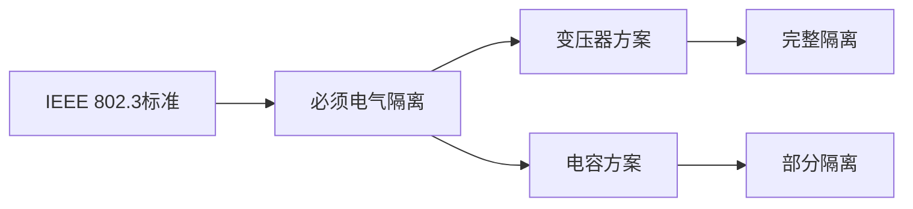
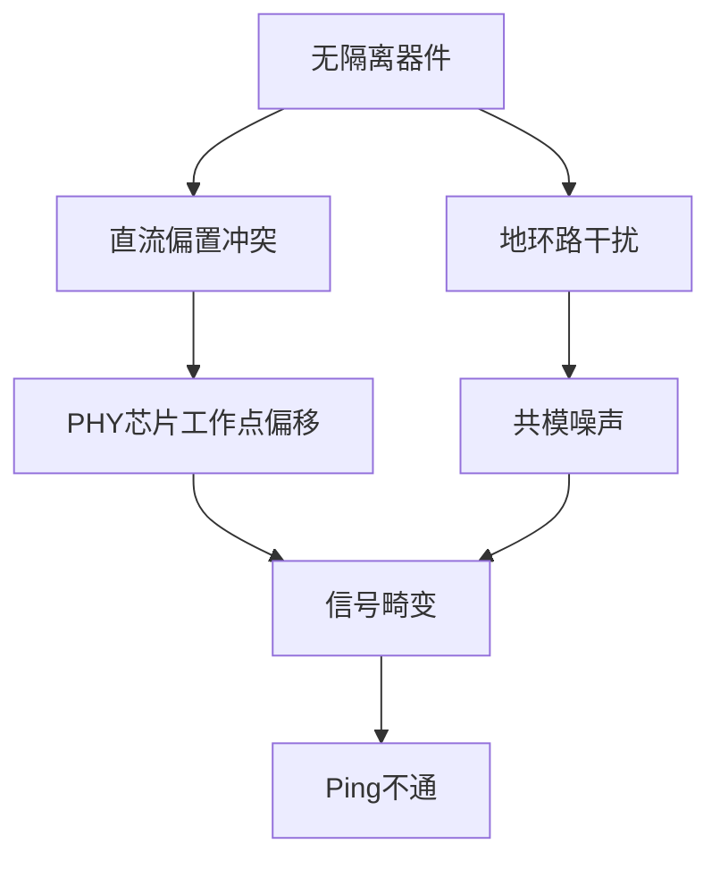
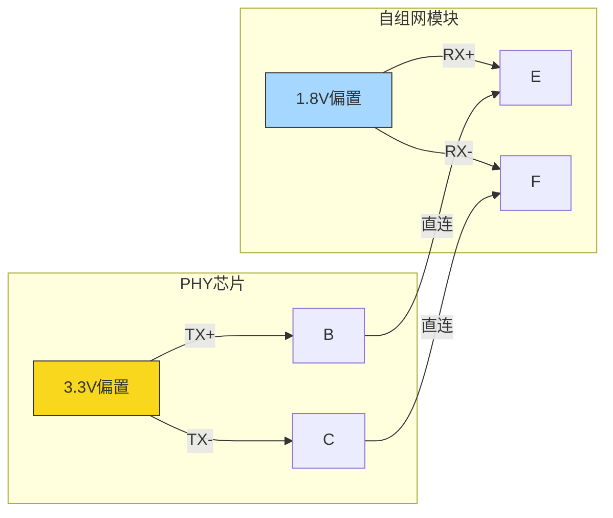

# 以太网GMAC调试

本节介绍嵌入式平台以太网（GMAC）接口的常见测试方法、调试工具和一键检测脚本，适用于开发板、工控机等场景。

## 功能简介
- 以太网接口用于连接局域网/互联网，实现有线网络通信。
- 常见需求包括：
  - 检查网口物理连接和状态
  - 验证10M/100M/1000M速率
  - 驱动、PHY识别与调试

## 常用工具
- `ifconfig`/`ip addr`：查看网口状态和IP地址
- `ethtool`：查询和设置以太网设备参数
- `dmesg`：查看内核网口/PHY相关日志
- `ping`/`iperf3`：网络连通性和性能测试

## 常用命令
- 查看网口状态：
  - `ifconfig -a`
  - `ip addr`
- 查看驱动和PHY识别日志：
  - `dmesg | grep -i phy`
  - `dmesg | grep -i gmac`
- 查看链路状态：
  - `ethtool eth0`
- 启用网口/获取IP：
  - `ifconfig eth0 up`
  - `udhcpc -i eth0` 或 `dhclient eth0`
- 网络连通性测试：
  - `ping 192.168.1.1`

---

## 附录：以太网一键检测脚本

> 说明：本脚本可一键收集以太网接口状态、驱动日志、链路信息等，便于整体排查。请复制到板子上执行。

```sh
#!/bin/sh

echo "===== 1. 网口状态 ====="
ifconfig -a
ip addr

echo "\n===== 2. 驱动/PHY识别日志 ====="
dmesg | grep -i phy | tail -n 30
dmesg | grep -i gmac | tail -n 30

echo "\n===== 3. 链路状态 ====="
if command -v ethtool >/dev/null; then
  ethtool eth0
else
  echo "ethtool 未安装，跳过链路详细状态检测"
fi

echo "\n===== 4. 获取IP地址（DHCP） ====="

# 尝试后台获取IP，超时自动继续
echo "尝试通过 udhcpc 获取IP（最多5秒）..."
udhcpc -i eth0 2>/dev/null &
udhcpc_pid=$!
timeout=5
while kill -0 $udhcpc_pid 2>/dev/null && [ $timeout -gt 0 ]; do
  sleep 1
  timeout=$((timeout-1))
done
if kill -0 $udhcpc_pid 2>/dev/null; then
  echo "udhcpc 超时，自动终止"
  kill $udhcpc_pid
fi

# 如果还没获取到IP，再尝试 dhclient（同样限时5秒）
if ! ifconfig eth0 | grep -q 'inet '; then
  echo "尝试通过 dhclient 获取IP（最多5秒）..."
  dhclient eth0 2>/dev/null &
  dhclient_pid=$!
  timeout=5
  while kill -0 $dhclient_pid 2>/dev/null && [ $timeout -gt 0 ]; do
    sleep 1
    timeout=$((timeout-1))
  done
  if kill -0 $dhclient_pid 2>/dev/null; then
    echo "dhclient 超时，自动终止"
    kill $dhclient_pid
  fi
fi

echo "\n===== 5. ARP表 ====="
arp -a

echo "\n===== 6. 路由表 ====="
route -n
ip route

echo "\n===== 7. 网口收发包统计 ====="
ifconfig eth0

# 连通性测试（可按需修改目标IP）
echo "\n===== 8. 网络连通性测试 ====="
ping -c 4 192.168.1.1 2>/dev/null

# 性能测试（如有iperf3）
if command -v iperf3 >/dev/null; then
  echo "\n===== 9. 网络性能测试（iperf3） ====="
  iperf3 -c 192.168.1.1 -t 5 2>/dev/null
fi

echo "\n===== 检查完成，请结合回显分析以太网功能 ====="
```

> 如需定制检测内容（如指定网口名、目标IP等），可在脚本中补充相应命令。

```bash
ifconfig
ifconfig wlan0 down
ifconfig lo down

# echo 124 > /sys/class/gpio/export
# cat /sys/class/gpio/gpio124/value
# cat /sys/class/gpio/gpio124/direction
# echo out > /sys/class/gpio/gpio124/direction
# echo 0 > /sys/class/gpio/gpio124/value
# sleep 3
# echo 1 > /sys/class/gpio/gpio124/value
ifconfig eth0

ifconfig eth0 192.168.253.100 up
ifconfig
cat /sys/class/net/eth0/operstate

ping 192.168.253.253


echo 0x12 0x0 > /sys/bus/mdio_bus/devices/stmmac-1:01/phy_registers    # 强制MDI
cat /sys/bus/mdio_bus/devices/stmmac-1:01/phy_registers
echo 0x12 0x4000 > /sys/bus/mdio_bus/devices/stmmac-1:01/phy_registers # 强制MDIx
cat /sys/bus/mdio_bus/devices/stmmac-1:01/phy_registers


cat /sys/bus/mdio_bus/devices/stmmac-1:01/phy_registers
```


# 以太网接口异常问题技术分析

## 1. 接口规范要求

## 2. 必须加隔离器件的原因
### 2.1 不加隔离的问题

- 具体表现：
    - 当两端PHY芯片直流偏置不同（如3.3V vs 1.8V）时，直接连接会导致：
    - 电流倒灌
    - 信号电平被拉偏
    - 芯片可能损坏
## 3. 线序反接能通的现象解析

- 深层原理：

1. PHY芯片内部差分对的直流特性不对称

2. 反接可能意外满足：
		
	- 直流偏置电压兼容
		
	- 共模电压范围要求

3. 但这种连接：

	- 不稳定（受温度/器件批次影响）

  	- 不符合规范

	- 抗干扰能力差


# 以太网PHY直连异常分析（含图示）

## 1. 正常接法故障原理


- 问题分析：

  - 直流冲突：3.3V与1.8V系统直接对接形成电流倒灌路径

  - 电平畸变：

```text
PHY侧期望电平：2.8V~3.8V (3.3V±0.5V)
模块侧实际获得：≈2.5V±0.5V（被1.8V系统拉偏）
```
  - 结果：信号幅度不足导致误码

## 2.反接能通的偶然性


- 意外导通原因：

1. 差分对不对称性：

	- PHY的TX+/-驱动能力存在微小差异

	- 模块的RX+/-输入阻抗不完全对称

2. 直流偏置巧合：

```text
反接后等效电路：
PHY_TX+ → 模块_RX-（通过1.8V负载）
PHY_TX- → 模块_RX+（通过1.8V负载）
形成新的直流平衡点≈2.2V
```
3. 信号幅度：

	- 实际获得：2.2V±0.5V（刚好满足模块识别阈值）